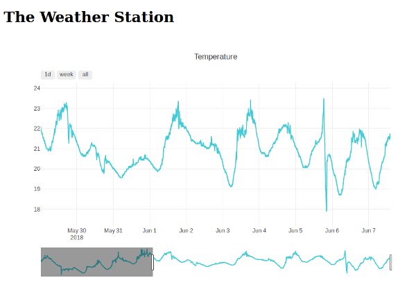

# Weather Station Monitoring

weatherstation is a python app that provides a dashboard showing output from your Raspberry Pi weather station.

It's currently really basic, so only provides temperature readouts.



## Setup

weatherstation is written using python and dash, but if you have docker installed you don't need to worry about that.

You'll need to ensure your weather station is logging temperatures into a database with time and temp columns, like this:

```
time | temp
----------
2018-06-03T14:45:35|21.312
2018-06-03T14:47:57|21.312
2018-06-03T14:50:19|21.375
2018-06-03T14:52:41|21.312
2018-06-03T14:55:03|21.312
2018-06-03T14:57:25|21.312
2018-06-03T14:59:48|21.375
```
This is a UTC datetime and a temperature in degrees celsius as a numeric(5,3)

Add the database connection details to a file called database.ini (see the example)

To start the dashboard run:
```
docker run --name weather -d -p 5000:5000 -v database.ini:/app/conf/database.ini lucyb/weatherstation
```

Then access the dashboard in a browser, using the address http://localhost:5000

## Building it yourself

To build your own docker image:

1. Checkout this code 
2. Add the connection details to the database in app/database.ini
3. Then run:
```
docker build . -t weatherstation
```

To build it without docker:
```
cd app
pip3 -r requirements.txt
cd web
python app.py
```
